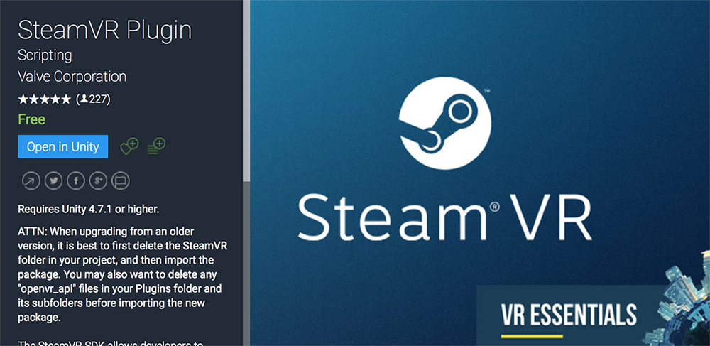
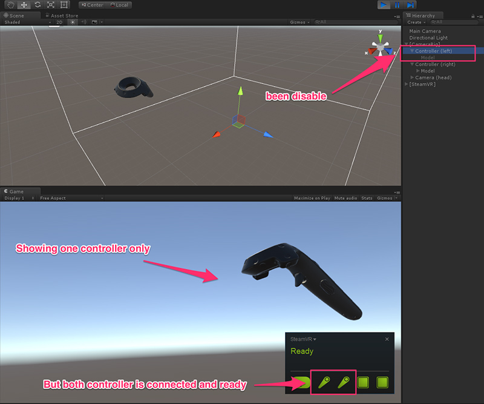
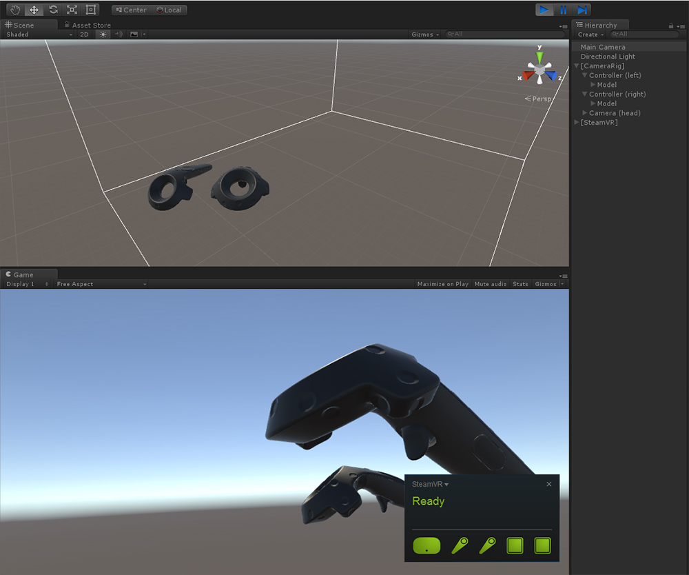

# SteamVR Plugin-1.1.0-Patch

## About
This is a patch that fix bug of Unity can only connecting one Vive controller with SteamVR plugin. This patch is for fixing the bug in this version. All rights belong to original developer [Valve Corporation](http://www.valvesoftware.com/).

## Problem
I meet a problem while I connect two Vive controllers in Unity. 

Some related discussion forums：

- [Vive Controller not showing up anymore, tried everything, need help](http://forum.unity3d.com/threads/vive-controller-not-showing-up-anymore-tried-everything-need-help.411294/)
- [Trouble with SteamVR and Controllers](http://forum.unity3d.com/threads/trouble-with-steamvr-and-controllers.414840/)

Example picture of this bug：

Showing on the figure above, the left controller wont connect and be able to use. The gameobject of it will be disable by code SteamVR_ControllerManager.cs.

Because the gameobject is disable, the controller model won't be render by SteamVR_RenderModel.cs and won't show on the scene.

## How to use
1. You can just download [SteamVR.unitypackage](./steamVR.unitypackage) and import it into your project.

2. If there are [SteamVR package](https://www.assetstore.unity3d.com/en/#!/content/32647) exist in your project, you can replace the code [SteamVR_ControllerManager.cs](./Scripts/SteamVR_ControllerManager.cs) and the bug will be fixed.

- Now you can get both controller in your project：

## Version

- Version: 1.1.0-patch (July 13, 2016)
- Size: 2.5 MB (without example scene)
- Originally released: 30 April 2015
- Package has been test on Unity 5.3.0 ~ 5.3.5
